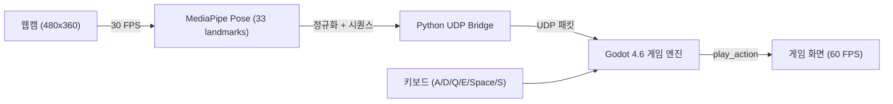
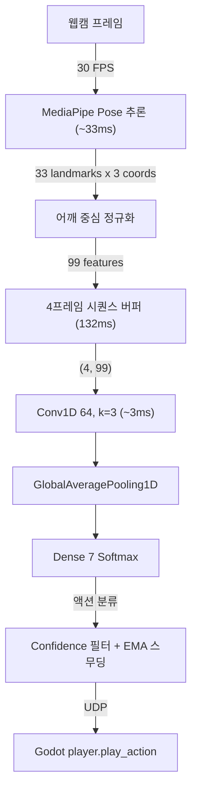

# Body Hero

> 웹캠 1인칭 헬스 복싱 게임 — **당신의 주먹이 곧 조이패드!**
>
> Godot 4.6 + MediaPipe Pose + 실시간 AI 동작 인식

## 시스템 구조



## AI 인식 파이프라인



## 성능 및 AI 인식률

| 지표 | 수치 |
|------|------|
| **포즈 인식 정확도** | **99.22%** (recording-based holdout 20%) |
| 참고: 내부 검증 | 99.90% (random split, 비교용) |
| **모델 파라미터** | **19,783** (~20K, 경량화) |
| **학습 시간** | ~6분 (CPU) |
| **첫 액션 반응 시간** | ~165ms (seq_buf 132ms + confirm 33ms) |
| **후속 액션 반응** | ~33ms (버퍼 가득, 1프레임) |
| **게임 엔진 프레임** | 60 FPS |
| **ML 파이프라인 프레임** | 30 FPS |
| **none recall** | 99.3% (false positive 거의 제거) |

### 동작별 인식률 (Recording-based Holdout)

| 동작 | Recall | Precision |
|------|--------|-----------|
| none (idle) | 99.3% | 98.3% |
| guard (가드) | 99.1% | 99.9% |
| punch_l (왼펀치) | 99.6% | 99.7% |
| punch_r (오른펀치) | 97.8% | 98.9% |
| upper_l (왼어퍼) | 99.6% | 99.8% |
| upper_r (오른어퍼) | 99.4% | 98.4% |
| squat (스쿼트) | 99.9% | 100.0% |

## 게임 플레이

### 🥊 웹캠 ML (권장)

1. 게임 실행 → 설정 → 웹캠 탭에서 카메라 선택 → **적용**
2. 스테이지 진입 시 웹캠 ML이 자동 실행됨
3. 실제로 주먹을 뻗으면 화면 속 글러브가 따라 펀치!

### ⌨️ 키보드 테스트

- **A / Z** — 왼펀치
- **D / C** — 오른펀치
- **Q** — 왼어퍼컷
- **E** — 오른어퍼컷
- **Space** — 가드 (누르는 동안)
- **S** — 스쿼트 (HP 회복)

> ⚠️ **리바인딩 지원**: 설정 패널에서 각 키를 원하는 키로 변경 가능

## 스테이지 구성

| 스테이지 | 몬스터 | 특징 |
|----------|--------|------|
| Stage 1 | 불고기 햄버거 | 느리지만 묵직한 펀치 |
| Stage 2 | 콜라 몬스터 | 빠르고 강력한 공격 |
| Stage 3 | 감자튀김 몬스터 | 날카로운 연속 공격 |
| Stage 4 | 피자 몬스터 | 강한 내구도, 둔한 움직임 |
| Stage 5 | 치킨 몬스터 | 모든 스탯 극한 |
| **Stage 6 (BOSS)** | **마라탕 보스** | 보스 페이즈 + 버프 선택 |
| Training | 트레이닝 더미 | 무한 리스폰 연습 모드 |

> 총 **7개 씬**: 스테이지 1~6(보스 포함) + 트레이닝

## 기술 스택

| 항목 | 버전/기술 |
|------|-----------|
| 게임 엔진 | Godot Engine 4.6 |
| 스크립트 | GDScript 2.0 |
| ML 프레임워크 | Python 3.10 + TensorFlow/Keras 2.16+ |
| 포즈 추정 | MediaPipe Pose 0.10+ |
| 통신 | UDP (localhost) |
| 아키텍처 | Conv1D(64, k=3) → GAP → Dense(7) |
| 파라미터 | ~20K |
| 테스트 | GUT (Godot Unit Test) |

## 프로젝트 구조

```
body-hero/
├── project.godot              # Godot 4.6 프로젝트
├── games/boxing/
│   ├── scenes/                # 스테이지 1~6(보스) + training (7개)
│   │   ├── stage_1.tscn       #   햄버거
│   │   ├── stage_2.tscn       #   콜라
│   │   ├── stage_3.tscn       #   감자튀김
│   │   ├── stage_4.tscn       #   피자
│   │   ├── stage_5.tscn       #   치킨
│   │   ├── stage_6.tscn       #   마라탕 보스
│   │   └── training.tscn      #   트레이닝 모드
│   └── scripts/               # 게임 로직
│       ├── enemy.gd           #   적 FSM (IDLE/ATTACK/EVADE/HIT/DEAD)
│       ├── player.gd          #   플레이어 글러브 + 입력
│       ├── stage.gd           #   스테이지 컨트롤러
│       └── combat_director.gd #   전투 판정/콤보
├── scripts/
│   ├── game_state.gd          # 전역 상태 (AutoLoad)
│   ├── game_state/            #   하위 모듈 13개
│   │   ├── workout_tracker.gd
│   │   ├── upgrade_system.gd
│   │   ├── achievements.gd
│   │   ├── shop.gd
│   │   ├── boss_manager.gd
│   │   └── ...
│   └── ui/                    # UI 패널 10개
│       ├── settings_panel.gd
│       ├── shop_panel.gd
│       └── ui_theme_helper.gd
├── tools/                     # Python ML + UDP 브리지
│   ├── train_pose_classifier_seq.py
│   ├── udp_send_webcam_ml.py
│   ├── pose_server.py
│   ├── collect_pose_data.py
│   └── *.keras                # 학습된 ML 모델
├── tests/
│   └── unit/
│       ├── test_enemy_fsm.gd     # FSM 단위 테스트 (23개)
│       └── test_game_state.gd    # GameState 테스트 (36개)
├── assets/
│   ├── textures/characters/   # 버거/콜라/프라이즈/피자/치킨/마라탕
│   ├── audio/bgm/             # BGM
│   └── audio/sfx/             # 효과음
└── docs/
    ├── experiments/           # ML 실험 기록
    │   ├── 2026-05-18-ablation-controlled.md
    │   ├── 2026-05-18-paper-design-decisions.md
    │   └── ...
    └── superpowers/           # 설계 문서 및 계획
```

## 빠른 시작

```bash
git clone https://github.com/wlgptjd333/body-hero.git
```

Godot 4.6으로 `project.godot` 열고 **F5** 실행.

- 첫 실행 시 `tools/python_embed/`가 없으면 GitHub Releases에서 자동 다운로드 + 설치합니다.
- 인터넷이 없는 환경에서는 `tools/python_ml_env.zip`을 직접 `tools/` 폴더에 넣으면 오프라인 설치 가능합니다.

## ML 데이터 수집 → 학습

```bash
cd tools
python_embed\python.exe collect_pose_data.py          # 데이터 수집
python_embed\python.exe train_pose_classifier_seq.py  # 4프레임 시퀀스 모델 학습
python_embed\python.exe pose_server.py                # ML 서버 실행
```

개발자 참고: `tools/build_python_embed.bat`로 python_embed 환경을 빌드한 후 위 명령을 실행하세요.

## 테스트

GUT 테스트 프레임워크 (59개, Godot 4.6):

```
프로젝트 → Gut → Run all tests
# 또는 CLI:
godot --headless -s addons/gut/gut_cmdln.gd -d --path .
```

## 라이선스

MIT License © 2026 Jihyeseong (지혜성)

> 이 프로젝트는 **협성대학교 졸업작품**으로 제작되었습니다.
